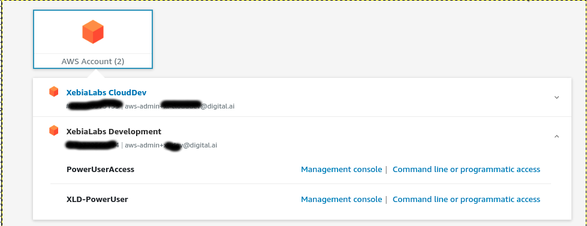

# AWS EKS

Here it will described how to install manually Deploy k8s cluster with help of operator to AWS EKS.
* Create Access key ID and secret access key.


    - For AWS SSO access use "Command line or programmatic access"
    
    

* [Install AWS CLI locally](https://docs.aws.amazon.com/cli/latest/userguide/getting-started-install.html)
    - [Configure AWS CLI locally](https://docs.aws.amazon.com/cli/latest/userguide/cli-configure-quickstart.html)
    
* (optional) [Create VPC and Subnets](https://docs.aws.amazon.com/eks/latest/userguide/create-public-private-vpc.html). We can also use the available vpc.

    
* Create [AWS EKS cluster role](https://docs.aws.amazon.com/eks/latest/userguide/service_IAM_role.html)


* Create [EC2 node group role](https://docs.aws.amazon.com/eks/latest/userguide/create-node-role.html)


* Create [EKS cluster](https://docs.aws.amazon.com/eks/latest/userguide/create-cluster.html)

* Create [node group](https://docs.aws.amazon.com/eks/latest/userguide/create-managed-node-group.html).    


* Configure the connection details.
```shell script
[sishwarya@localhost aws] $ rm -rf ~/.kube/config (optional)

[sishwarya@localhost aws] $ aws configure
AWS Access Key ID [None]: ASIA5SLLVCFXXXXXXX
AWS Secret Access Key [None]: NkQ9lQnsYXLp2t3TKXXXXXXXXXXXXX
Default region name [None]: 
Default output format [None]: json

[sishwarya@localhost aws] $ export AWS_ACCESS_KEY_ID="ASIA5SLLVCFXXXXXXX"
[sishwarya@localhost aws] $ export AWS_SECRET_ACCESS_KEY="NkQ9lQnsYXLp2t3TKXXXXXXXXXXXXX"
[sishwarya@localhost aws] $ export AWS_SESSION_TOKEN="IQoJb3JpZ2luX2VjEAIaCXVzLXdlXXXXXXXXXXXXXx"
```
```
aws eks --region eu-west-1 update-kubeconfig --name CLUSTER_NAME
```
`CLUSTER_NAME` name of the cluster created in a previous step.


 
* Validate the connection using kubectl. 


* Update the kube config of aws-auth.
    - Add the map role. ` kubectl edit configmap -n kube-system aws-auth`
 ```yaml
 mapRoles:
    ----
    - groups:
      - system:bootstrappers
      - system:nodes
      rolearn: arn:aws:iam::932770550094:role/aws-reserved/sso.amazonaws.com/us-west-2/AWSReservedSSO_XLD-XXXXXXX
      username: AWSReservedSSO_XLD-XXXXXXX
```

   - Verify updated configmap `kubectl describe configmap -n kube-system aws-auth`


* Update the infrastructure.yaml and  ran xl apply -f infrastructure.yaml and validate the connection by doing check connection in xl-deploy env.


 
```yaml
apiVersion: xl-deploy/v1
kind: Infrastructure
spec:
  - name: k8s-infra
    type: core.Directory
    children:
      - name: xld
        type: k8s.Master
        apiServerURL: >-
          <API SERVER ENDPOINT>
        skipTLS: true
        debug: true
        caCert: >-
          <CERTIFICATE AUTHORITY>
        isEKS: true
        useGlobal: true
        regionName: eu-west-1
        clusterName: <CLUSTER NAME>
        accessKey: <ACCESS KEY> (optional when we use AWS SSO)
        accessSecret: <SECRET KEY> (optional when we use AWS SSO)
        children:
          - name: default
            type: k8s.Namespace
            namespaceName: default
```

* Verify Check connection
