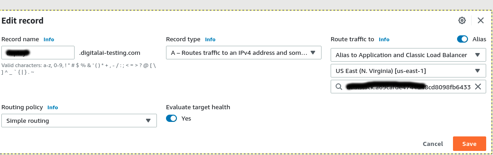

# AWS EKS

Here it will described how to install manually Deploy k8s cluster with help of operator to AWS EKS.
* Create Access key ID and secret access key.

  - Using My security credentials.
  
    

  - AWS SSO access use "Command line or programmatic access"
  
    
    

* [Install AWS CLI locally](https://docs.aws.amazon.com/cli/latest/userguide/getting-started-install.html)

* [Configure AWS CLI locally](https://docs.aws.amazon.com/cli/latest/userguide/cli-configure-quickstart.html)
    
* (optional) [Create VPC and Subnets](https://docs.aws.amazon.com/eks/latest/userguide/create-public-private-vpc.html). We can also use the available vpc.
    
    
* Create [AWS EKS cluster role](https://docs.aws.amazon.com/eks/latest/userguide/service_IAM_role.html)

    

* Create [EC2 node group role](https://docs.aws.amazon.com/eks/latest/userguide/create-node-role.html)

    

* Create [EKS cluster](https://docs.aws.amazon.com/eks/latest/userguide/create-cluster.html)

* Create [node group](https://docs.aws.amazon.com/eks/latest/userguide/create-managed-node-group.html).    


* Configure the connection details.
    ```shell script
    [sishwarya@localhost aws] $ rm -rf ~/.kube/config (optional)
    
    [sishwarya@localhost aws] $ aws configure
    AWS Access Key ID [None]: ASIA5SLLVCFXXXXXXX
    AWS Secret Access Key [None]: NkQ9lQnsYXLp2t3TKXXXXXXXXXXXXX
    Default region name [None]: 
    Default output format [None]: json
    
    [sishwarya@localhost aws] $ export AWS_ACCESS_KEY_ID="ASIA5SLLVCFXXXXXXX"
    [sishwarya@localhost aws] $ export AWS_SECRET_ACCESS_KEY="NkQ9lQnsYXLp2t3TKXXXXXXXXXXXXX"
    [sishwarya@localhost aws] $ export AWS_SESSION_TOKEN="IQoJb3JpZ2luX2VjEAIaCXVzLXdlXXXXXXXXXXXXXx"
    ```
    ```shell script
    aws eks --region eu-west-1 update-kubeconfig --name CLUSTER_NAME
    ```
    `CLUSTER_NAME` name of the cluster created in a previous step.

    
 
* Validate the connection using kubectl. 

    

* Update the kube config of aws-auth.
    - Edit the configmap `kubectl edit configmap -n kube-system aws-auth`.
        - AWS SSO user. Add the map role.
            ```yaml
                 mapRoles:
                    ----
                    - groups:
                      - system:bootstrappers
                      - system:nodes
                      rolearn: arn:aws:iam::932770550094:role/aws-reserved/sso.amazonaws.com/us-west-2/AWSReservedSSO_XLD-XXXXXXX
                      username: AWSReservedSSO_XLD-XXXXXXX
             ```
        - Normal user. Add the map user.
            ```yaml
                mapUsers: |
                    - userarn: arn:aws:iam::932770550094:user/<userName>
                      username: <username>
                      groups:
                        - system:masters
            ```
    - Verify updated configmap `kubectl describe configmap -n kube-system aws-auth`.

* Update the infrastructure.yaml and  ran xl apply -f infrastructure.yaml and validate the connection by doing check connection in xl-deploy env.

    
 
    ```yaml
    apiVersion: xl-deploy/v1
    kind: Infrastructure
    spec:
      - name: k8s-infra
        type: core.Directory
        children:
          - name: xld
            type: k8s.Master
            apiServerURL: >-
              <API SERVER ENDPOINT>
            skipTLS: true
            debug: true
            caCert: >-
              <CERTIFICATE AUTHORITY>
            isEKS: true
            useGlobal: true
            regionName: eu-west-1
            clusterName: <CLUSTER NAME>
            accessKey: <ACCESS KEY> (optional when we use AWS SSO)
            accessSecret: <SECRET KEY> (optional when we use AWS SSO)
            children:
              - name: default
                type: k8s.Namespace
                namespaceName: default
    ```

* Verify Check connection.

    

* Register the domain using Route 53.
    - Go [Route 53 console](https://console.aws.amazon.com/route53/v2/home#Dashboard).
    - Select hostedZone. Create hosted zone or select available one (***digitalai-testing.com***).
    - [Create record](https://docs.aws.amazon.com/Route53/latest/DeveloperGuide/resource-record-sets-creating.html).
        - Enable toggle  alias
        - Route Traffic to = Alias to Application and Classic Load Balancer.
        - Routing policy = (default value)
        - Record type = (default value)
        - Record Name = deploy

        

* Go through the process of [scaffolding](../scaffolding.md).
    - Update the xld_v1alpha1_digitalaideploy.yaml file
        - Change StorageClass to what you have. For example, you can use 'gp2', in case of using local file system.
        - ingress service type: LoadBalancer.
        - Change the ingress hosts - Replace it with the domain registered in the previous step.
            eg:
            ```yaml
                hosts:
                  - deploy.digitalai-testing.com
            ```

* Run xl apply -v -f digital-ai.yaml

* Validate the ingress and service
```shell script
[sishwarya@localhost deploy-operator-awseks] $ kubectl get ing
NAME                                      CLASS    HOSTS                          ADDRESS   PORTS   AGE
digitalaideploy-sample-digitalai-deploy   <none>   deploy.digitalai-testing.com             80      75s

[sishwarya@localhost deploy-operator-awseks] $ kubectl get svc
NAME                                                              TYPE           CLUSTER-IP       EXTERNAL-IP                                                               PORT(S)                                 AGE
controller-manager-metrics-service                                ClusterIP      10.100.135.147   <none>                                                                    8443/TCP                                2m14s
digitalaideploy-sample-digitalai-deploy-lb                        ClusterIP      10.100.91.46     <none>                                                                    4516/TCP                                88s
digitalaideploy-sample-digitalai-deploy-master                    ClusterIP      None             <none>                                                                    8180/TCP                                88s
digitalaideploy-sample-digitalai-deploy-worker                    ClusterIP      None             <none>                                                                    8180/TCP                                88s
digitalaideploy-sample-nginx-ingress-controller                   LoadBalancer   10.100.45.115    a69cafde4744d48cd8098fb6xxxxxx-1776330415.us-east-1.elb.amazonaws.com   80:31192/TCP,443:31498/TCP              88s
digitalaideploy-sample-nginx-ingress-controller-default-backend   ClusterIP      10.100.67.17     <none>                                                                    80/TCP                                  88s
digitalaideploy-sample-postgresql                                 ClusterIP      10.100.131.156   <none>                                                                    5432/TCP                                88s
digitalaideploy-sample-postgresql-headless                        ClusterIP      None             <none>                                                                    5432/TCP                                88s
digitalaideploy-sample-rabbitmq                                   ClusterIP      10.100.4.80      <none>                                                                    5672/TCP,4369/TCP,25672/TCP,15672/TCP   88s
digitalaideploy-sample-rabbitmq-headless                          ClusterIP      None             <none>                                                                    4369/TCP,5672/TCP,25672/TCP,15672/TCP   88s
kubernetes                                                        ClusterIP      10.100.0.1       <none>                                                                    443/TCP                                 18h
```
* Edit record of deploy-digitalai-testing.com of Route 53
    - Update region where our cluster is running
    - Select the load balancer.

      

* Login using the domain "http://deploy.digitalai-testing.com/xl-deploy"

    


## Troubleshooting
   - Unauthorized error. Go to your AWS SSO commad line, to verify the access and secret key.
        ```shell script
            [sishwarya@localhost bin] $ kubectl describe configmap -n kube-system aws-auth
            error: You must be logged in to the server (Unauthorized)
        ```
        - update the latest access and secret key in bashrc
            ```shell script
                          vi ~/.bashrc
                          export AWS_ACCESS_KEY_ID="ASIA5SLLVCFxxxxx"
                          export AWS_SECRET_ACCESS_KEY="NkQ9lQnsYXLp2t3TKUJiX58V0Rctkxxxx"
                          export AWS_SESSION_TOKEN="IQoJb3JpZXXXXXXX"
                          source ~/.bashrc
            ```