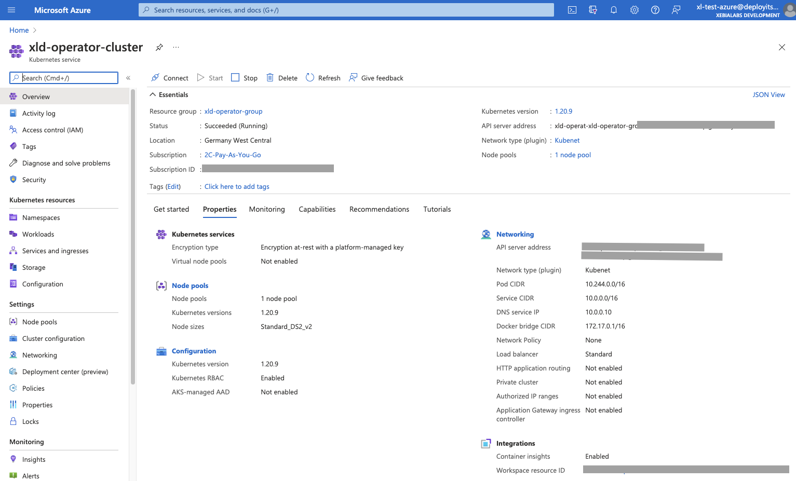
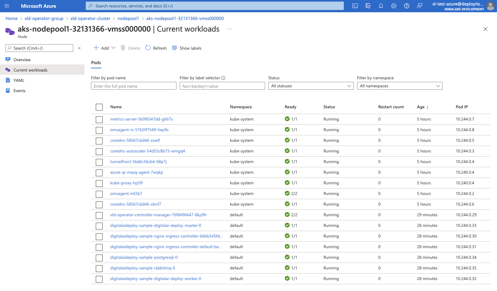
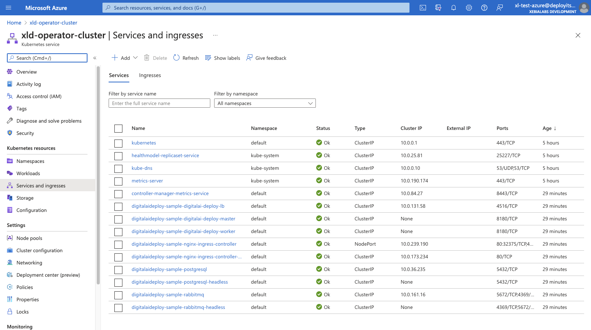

# Azure

Here it will be described how to install manually Deploy k8s cluster with help of operator to Azure.

* You should install [Azure CLI locally](https://docs.microsoft.com/en-us/cli/azure/install-azure-cli)
* Use kubernetes walkthrough, in the next section with `az` to setup k8s cluster. Here are more detailed description: [Deploy an Azure Kubernetes Service cluster using the Azure CLI](https://docs.microsoft.com/en-us/azure/aks/kubernetes-walkthrough) as alternative use [GUI alternative](https://docs.microsoft.com/en-us/azure/aks/kubernetes-walkthrough-portal)
  * Check first Prerequisites to [Sign in with Azure CLI](https://docs.microsoft.com/en-us/cli/azure/authenticate-azure-cli)

## Create the cluster

Here are basic steps to setup k8s cluster.

Create a resource group
```shell
❯ az group create --name xld-operator-group --location germanywestcentral
{
  "id": "/subscriptions/.../resourceGroups/xld-operator-group",
  "location": "germanywestcentral",
  "managedBy": null,
  "name": "xld-operator-group",
  "properties": {
    "provisioningState": "Succeeded"
  },
  "tags": null,
  "type": "Microsoft.Resources/resourceGroups"
}
```

Create new TLS private key (in other way it is using default key from SSL config)
```shell
ssh-keygen -f ssh-key-xld-operator-cluster -N "" -m pem
```
This will create new private and public key files. We will use public file `ssh-key-xld-operator-cluster.pub` in the next step.   

### Create an AKS cluster

Check available k8s versions, if default one is 1.20.x it is OK, 
in other case in next step during cluster creation use option `--kubernetes-version` with available 1.20.x version as value:
```shell
az aks get-versions --location germanywestcentral
```

Create an AKS cluster 

```shell
❯ az aks create --resource-group xld-operator-group  --name xld-operator-cluster --node-count 1 --enable-addons monitoring --ssh-key-value ssh-key-xld-operator-cluster.pub
AAD role propagation done[############################################]  100.0000%{
  "aadProfile": null,
  ...
  "sku": {
    "name": "Basic",
    "tier": "Free"
  },
  "tags": null,
  "type": "Microsoft.ContainerService/ManagedClusters",
  "windowsProfile": null
}
```

:::tip

If you need to scale number of replicas 1 default node will not be enough (default node-vm-size is `Standard_DS2_v2` with 7GiB and 2vCPU), 
so use `--node-count 2` or `--node-vm-size Standard_DS3_v2` with 14GiB and 4vCPU.

:::

Result on the Azure Portal dashboard:


Connect to the cluster
```shell
❯ az aks get-credentials --resource-group xld-operator-group --name xld-operator-cluster
Merged "xld-operator-cluster" as current context in /Users/vpugar/.kube/config
```

Check if your cluster is fully functional
```shell
❯ kubectl get node
NAME                                STATUS   ROLES   AGE     VERSION
aks-nodepool1-32131366-vmss000000   Ready    agent   6h36m   v1.20.9
```

You can take now the keys and URL and update `deploy-operator-azure-aks/digitalai-deploy/infrastructure.yaml`. Following are mappings:

|Field name|Path to the cert|
| :---: | :---: |
|apiServerURL|~/.kube/config:clusters\[name=xld-operator-cluster\].cluster.server|
|caCert|~/.kube/config:clusters\[name=xld-operator-cluster\].cluster.certificate-authority-data|
|tlsCert|~/.kube/config:users\[name=clusterUser_xld-operator-group_xld-operator-cluster\].user.client-certificate-data|
|tlsPrivateKey|~/.kube/config:users\[name=clusterUser_xld-operator-group_xld-operator-cluster\].user.client-key-data|

You can use base64 encoded values from the `~/.kube/config`, as is, in that case, from the `infrastructure.yaml`, just remove header/footer lines with `-----` that under that specific key value that you are replacing.

## Storage class

Get default storage class
```shell
❯ kubectl get storageclass
NAME                PROVISIONER                RECLAIMPOLICY   VOLUMEBINDINGMODE      ALLOWVOLUMEEXPANSION   AGE
azurefile           kubernetes.io/azure-file   Delete          Immediate              true                   6h36m
azurefile-premium   kubernetes.io/azure-file   Delete          Immediate              true                   6h36m
default (default)   kubernetes.io/azure-disk   Delete          WaitForFirstConsumer   true                   6h36m
managed-premium     kubernetes.io/azure-disk   Delete          WaitForFirstConsumer   true                   6h36m
```
It should be used `default`, so update all occurrences of storageClass in the `xld_v1alpha_digitaldeploy.yaml` to `default` value.

### Azure Files Dynamic 

storageClass `default` is not good enough for the database setup and other shared folders' requirement, so in that case
there are multiple ways to create shared data-volumes, here are options:
- [Azure Disk Dynamic](https://docs.microsoft.com/en-us/azure/aks/azure-disks-dynamic-pv) (can be used by only one node)
- [Azure Files Dynamic](https://docs.microsoft.com/en-us/azure/aks/azure-files-dynamic-pv) 
- [Azure Files Static](https://docs.microsoft.com/en-us/azure/aks/azure-files-volume) 
- [NFS server Static](https://docs.microsoft.com/en-us/azure/aks/azure-nfs-volume) (NFS Server onto a Virtual Machine)
- and others, see [Storage options for applications in Azure Kubernetes Service (AKS)](https://docs.microsoft.com/en-us/azure/aks/concepts-storage)

**Following was tested with Azure Files and Disk Dynamic**

Create a file named `azure-file-sc.yaml`:
```yaml
kind: StorageClass
apiVersion: storage.k8s.io/v1
metadata:
  name: xld-operator-azurefile
provisioner: kubernetes.io/azure-file
mountOptions:
  - dir_mode=0777
  - file_mode=0777
  - uid=0
  - gid=0
  - mfsymlinks
  - cache=strict
  - actimeo=30
parameters:
  skuName: Standard_LRS
```
Using Standard_LRS - standard locally redundant storage (LRS).

Apply it
```shell
❯ kubectl apply -f azure-file-sc.yaml
storageclass.storage.k8s.io/xld-operator-azurefile created
```

The `xld-operator-azurefile` storage class must be marked only the default annotation so that PersistentVolumeClaim objects (without a StorageClass specified) will trigger dynamic provisioning.
```shell
❯ kubectl patch storageclass xld-operator-azurefile -p '{"metadata": {"annotations":{"storageclass.kubernetes.io/is-default-class":"true"}}}'
storageclass.storage.k8s.io/xld-operator-azurefile patched
❯ kubectl patch storageclass default -p '{"metadata": {"annotations":{"storageclass.kubernetes.io/is-default-class":"false"}}}'
storageclass.storage.k8s.io/default patched
```

Previous setup `xld-operator-azurefile` will not work correctly with PostgreSQL. This is because PostgreSQL requires hard links in the Azure File directory, and since Azure File does not support hard links the pod fails to start.
So we need additional storageClass with Azure disk. Create a file named `azure-disk-sc.yaml`:
```yaml
kind: StorageClass
apiVersion: storage.k8s.io/v1
metadata:
  name: xld-operator-azuredisk
provisioner: kubernetes.io/azure-disk
reclaimPolicy: Delete
volumeBindingMode: WaitForFirstConsumer
parameters:
  storageaccounttype: Standard_LRS
```

Apply it
```shell
❯ kubectl apply -f azure-disk-sc.yaml
storageclass.storage.k8s.io/xld-operator-azuredisk created
```

Check storage class, it should be something like this:
```shell
❯ kubectl get storageclass
NAME                               PROVISIONER                RECLAIMPOLICY   VOLUMEBINDINGMODE      ALLOWVOLUMEEXPANSION   AGE
azurefile                          kubernetes.io/azure-file   Delete          Immediate              true                   49m
azurefile-premium                  kubernetes.io/azure-file   Delete          Immediate              true                   49m
default                            kubernetes.io/azure-disk   Delete          WaitForFirstConsumer   true                   49m
managed-premium                    kubernetes.io/azure-disk   Delete          WaitForFirstConsumer   true                   49m
xld-operator-azuredisk             kubernetes.io/azure-disk   Delete          WaitForFirstConsumer   false                  4m56s
xld-operator-azurefile (default)   kubernetes.io/azure-file   Delete          Immediate              false                  29m
```

It should be used now as storageClass `xld-operator-azurefile`. 
So update all occurrences of storageClass in the `xld_v1alpha_digitaldeploy.yaml` to `xld-operator-azurefile` value, 
except one under 
- `spec.postgresql.common.global.storageClass`
- `spec.postgresql.global.storageClass`
- `spec.postgresql.persitence.storageClass`

there should be `xld-operator-azuredisk`.

## Setting up Azure DNS

Here we will setup Azure DNS. For setting up details check [Apply a DNS label to the service](https://docs.microsoft.com/en-us/azure/aks/static-ip#apply-a-dns-label-to-the-service).

The final URL will be in the following example: [http://xld-operator123.germanywestcentral.cloudapp.azure.com/xl-deploy/#/explorer](http://xld-operator123.germanywestcentral.cloudapp.azure.com/xl-deploy/#/explorer)

Update `xld_v1alpha_digitaldeploy.yaml` on following places:
- `spec.ingress.hosts` update first element to `xld-operator123.germanywestcentral.cloudapp.azure.com`
- `spec.nginx-ingress-controller.service.annotations` add annotation: `service.beta.kubernetes.io/azure-dns-label-name: xld-operator123`

After successful startup of the operator, check following:

```shell
❯ kubectl get ing
NAME                                      CLASS    HOSTS                                                   ADDRESS   PORTS   AGE
digitalaideploy-sample-digitalai-deploy   <none>   xld-operator123.germanywestcentral.cloudapp.azure.com             80      15m
```

and (here check for the events, events need to be both here):
```shell
❯ kubectl describe service digitalaideploy-sample-nginx-ingress-controller
Name:                     digitalaideploy-sample-nginx-ingress-controller
Namespace:                default
Labels:                   app.kubernetes.io/component=controller
                          app.kubernetes.io/instance=digitalaideploy-sample
                          app.kubernetes.io/managed-by=Helm
                          app.kubernetes.io/name=nginx-ingress-controller
                          helm.sh/chart=nginx-ingress-controller-7.4.2
Annotations:              meta.helm.sh/release-name: digitalaideploy-sample
                          meta.helm.sh/release-namespace: default
                          service.beta.kubernetes.io/azure-dns-label-name: xld-operator123
Selector:                 app.kubernetes.io/component=controller,app.kubernetes.io/instance=digitalaideploy-sample,app.kubernetes.io/name=nginx-ingress-controller
Type:                     LoadBalancer
IP Families:              <none>
IP:                       10.0.212.10
IPs:                      10.0.212.10
LoadBalancer Ingress:     20.79.230.4
Port:                     http  80/TCP
TargetPort:               http/TCP
NodePort:                 http  30834/TCP
Endpoints:                10.244.1.10:80
Port:                     https  443/TCP
TargetPort:               https/TCP
NodePort:                 https  31593/TCP
Endpoints:                10.244.1.10:443
Session Affinity:         None
External Traffic Policy:  Cluster
Events:
  Type    Reason                Age   From                Message
  ----    ------                ----  ----                -------
  Normal  EnsuringLoadBalancer  16m   service-controller  Ensuring load balancer
  Normal  EnsuredLoadBalancer   16m   service-controller  Ensured load balancer
```

## Start operator

Run following command
```shell
xl apply -v -f digital-ai.yaml 
```

Check services in shell:
```shell
❯ kubectl get services
NAME                                                              TYPE           CLUSTER-IP     EXTERNAL-IP   PORT(S)                                 AGE
controller-manager-metrics-service                                ClusterIP      10.0.104.207   <none>        8443/TCP                                4m37s
digitalaideploy-sample-digitalai-deploy-lb                        ClusterIP      10.0.243.11    <none>        4516/TCP                                3m25s
digitalaideploy-sample-digitalai-deploy-master                    ClusterIP      None           <none>        8180/TCP                                3m25s
digitalaideploy-sample-digitalai-deploy-worker                    ClusterIP      None           <none>        8180/TCP                                3m25s
digitalaideploy-sample-nginx-ingress-controller                   LoadBalancer   10.0.212.10    20.79.230.4   80:30834/TCP,443:31593/TCP              3m25s
digitalaideploy-sample-nginx-ingress-controller-default-backend   ClusterIP      10.0.104.158   <none>        80/TCP                                  3m25s
digitalaideploy-sample-postgresql                                 ClusterIP      10.0.15.27     <none>        5432/TCP                                3m25s
digitalaideploy-sample-postgresql-headless                        ClusterIP      None           <none>        5432/TCP                                3m25s
digitalaideploy-sample-rabbitmq                                   ClusterIP      10.0.31.132    <none>        5672/TCP,4369/TCP,25672/TCP,15672/TCP   3m25s
digitalaideploy-sample-rabbitmq-headless                          ClusterIP      None           <none>        4369/TCP,5672/TCP,25672/TCP,15672/TCP   3m25s
kubernetes                                                        ClusterIP      10.0.0.1       <none>        443/TCP                                 3h3m
```

The final result on Azure Portal, all should be running (running all with 1 replica) with list of pods and services :



### Troubleshouting
There are possible problems during deployment:
- if deployment fails because not matching namespace, just remove nemaspeace from the yaml file 
  - for example during `Create Service controller-manager-metrics-service`. Just remove namespace from the xld-operator-setup/config/rbac/auth-proxy-service.yaml

## Delete the cluster

Clean up your unnecessary resources, use the az group delete command to remove the resource group, container service, and all related resources.
```shell
❯ az group delete --name xld-operator-group --yes --no-wait
```
