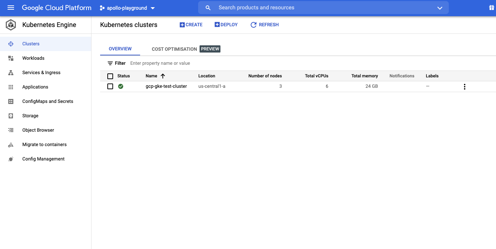
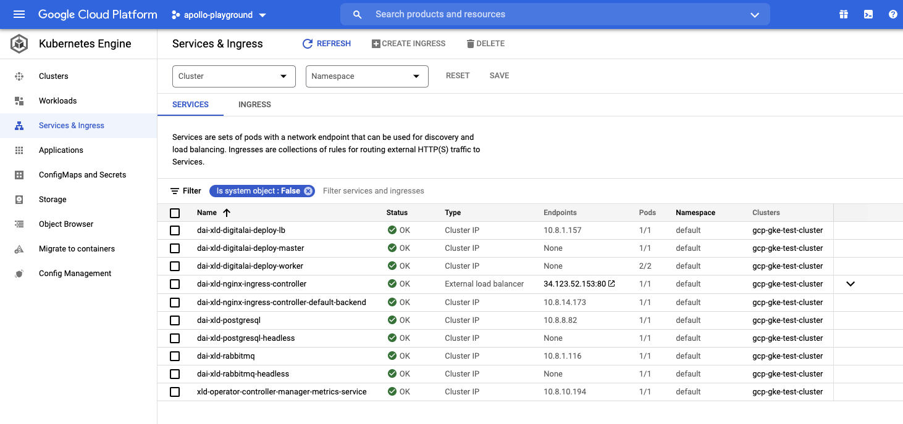
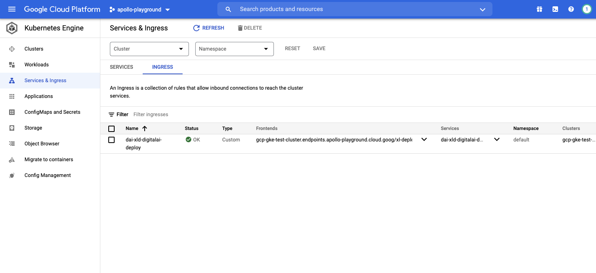
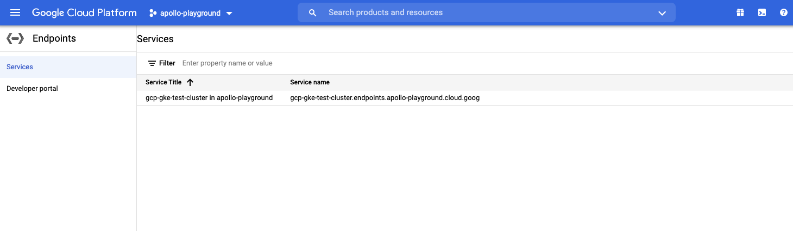

# Google Cloud Platform GKE

Here it will be described how to install manually Deploy k8s cluster with help of operator to GCP GKE.

* You should install [gcloud CLI locally](https://cloud.google.com/sdk/docs/install)
* Use kubernetes walkthrough, in the next section with `gcloud` to setup k8s cluster. Here are more detailed description: [Quickstart](https://cloud.google.com/kubernetes-engine/docs/quickstart)
* Login with `gcloud` cli with your google account and [select or create project](https://cloud.google.com/resource-manager/docs/creating-managing-projects)  

## Create the cluster

Here are basic steps to setup k8s cluster
- 3 nodes
- machine type: `e2-standard-2` - 2vCPUs, 8GB
- Kubernetes version: `1.20.11-gke.1801`
- with GcePersistentDiskCsiDriver addon to enable `standard-rwo` StorageClass

Create an GCP GKE cluster
```shell
❯ gcloud beta container --account "user@gmail.com" --project "apollo-playground" clusters create "gcp-gke-test-cluster" --zone  "us-central1-a" --release-channel "regular" --num-nodes "3" --machine-type "e2-standard-2" --cluster-version "1.20.11-gke.1801" --image-type "COS_CONTAINERD" --metadata disable-legacy-endpoints=true --logging=SYSTEM,WORKLOAD --monitoring=SYSTEM --enable-ip-alias --no-enable-master-authorized-networks --addons HorizontalPodAutoscaling,HttpLoadBalancing,GcePersistentDiskCsiDriver --enable-autoupgrade --enable-autorepair --enable-shielded-nodes 
NAME                  LOCATION       MASTER_VERSION    MASTER_IP      MACHINE_TYPE   NODE_VERSION      NUM_NODES  STATUS
gcp-gke-test-cluster  us-central1-a  1.20.11-gke.1801  34.121.95.175  e2-standard-2  1.20.11-gke.1801  3          RUNNING
WARNING: The Pod address range limits the maximum size of the cluster. Please refer to https://cloud.google.com/kubernetes-engine/docs/how-to/flexible-pod-cidr to learn how to optimize IP address allocation.
Creating cluster gcp-gke-test-cluster in us-central1-a...
.................................................................................................................................................................................................................................................................................................................................................................................................................................................................................................................................................................................................................................................................................................................................................................................................................................................................................................................................................................................................................................................................................................done.
Created [https://container.googleapis.com/v1beta1/projects/apollo-playground/zones/us-central1-a/clusters/gcp-gke-test-cluster].
To inspect the contents of your cluster, go to: https://console.cloud.google.com/kubernetes/workload_/gcloud/us-central1-a/gcp-gke-test-cluster?project=apollo-playground
kubeconfig entry generated for gcp-gke-test-cluster.
```

Result on the GCP console:


Connect to the cluster
```shell
❯ gcloud beta container --account "user@gmail.com" --project "apollo-playground" clusters get-credentials "gcp-gke-test-cluster" --zone "us-central1-a"
Fetching cluster endpoint and auth data.
kubeconfig entry generated for gcp-gke-test-cluster.
```

Check if your cluster is fully functional
```shell
❯ kubectl get node
NAME                                                  STATUS   ROLES    AGE   VERSION
gke-gcp-gke-test-cluster-default-pool-d354d6a9-0627   Ready    <none>   35m   v1.20.11-gke.1801
gke-gcp-gke-test-cluster-default-pool-d354d6a9-0ljz   Ready    <none>   35m   v1.20.11-gke.1801
gke-gcp-gke-test-cluster-default-pool-d354d6a9-bgfb   Ready    <none>   35m   v1.20.11-gke.1801
```

You can take now the keys and URL and update `deploy-operator-gcp-gke/digitalai-deploy/infrastructure.yaml`. Following are mappings:

|Field name|                                                      Path to the cert                                                       |
| :---: |:---------------------------------------------------------------------------------------------------------------------------:|
|apiServerURL|~/.kube/config:clusters\[name=gke_apollo-playground_us-central1-a_gcp-gke-test-cluster\].cluster.server|
|caCert|~/.kube/config:clusters\[name=gke_apollo-playground_us-central1-a_gcp-gke-test-cluster\].cluster.certificate-authority-data|
|token|~/.kube/config:users\[name=gke_apollo-playground_us-central1-a_gcp-gke-test-cluster\].user.auth-provider.config.access-token|

You can use base64 encoded values from the `~/.kube/config`, as is, in that case, from the `infrastructure.yaml`.

## Storage class

Get default storage class
```shell
❯ kubectl get storageclass
NAME           PROVISIONER             RECLAIMPOLICY   VOLUMEBINDINGMODE      ALLOWVOLUMEEXPANSION   AGE
premium-rwo    pd.csi.storage.gke.io   Delete          WaitForFirstConsumer   true                   49m
standard       kubernetes.io/gce-pd    Delete          Immediate              true                   49m
standard-rwo   pd.csi.storage.gke.io   Delete          WaitForFirstConsumer   true                   49m
```
It is already set in the `daideploy_cr.yaml`.

### Compute Engine persistent disk CSI Driver

When during cluster creation we have enabled addon `GcePersistentDiskCsiDriver`, it can be enabled after creation too:

```
❯ gcloud container clusters update "gcp-gke-test-cluster" --update-addons=GcePersistentDiskCsiDriver=ENABLED
```
There are enabled 2 storage classes:
- standard-rwo
- premium-rwo

Update the storageClass in the `daideploy_cr.yaml` to `standard-rwo` on paths:
- `spec.postgresql.persistence.storageClass`
- `spec.rabbitmq.persistence.storageClass`.

For details check [Using the Compute Engine persistent disk CSI Driver](https://cloud.google.com/kubernetes-engine/docs/how-to/persistent-volumes/gce-pd-csi-driver)

## Start operator

To be able to connect to deploy via Google's Endpoints, update `daideploy_cr.yaml` on following places:
- `spec.ingress.hosts` update first element to `gcp-gke-test-cluster.endpoints.apollo-playground.cloud.goog`
- `spec.route.hosts` update first element to `gcp-gke-test-cluster`

Run following command
```shell
xl apply -v -f digital-ai.yaml 
```

Check services in shell:
```shell
❯ kubectl get services
NAME                                               TYPE           CLUSTER-IP    EXTERNAL-IP     PORT(S)                                 AGE
dai-xld-digitalai-deploy-lb                        ClusterIP      10.8.1.157    <none>          4516/TCP                                48m
dai-xld-digitalai-deploy-master                    ClusterIP      None          <none>          8180/TCP                                48m
dai-xld-digitalai-deploy-worker                    ClusterIP      None          <none>          8180/TCP                                48m
dai-xld-nginx-ingress-controller                   LoadBalancer   10.8.0.3      34.123.52.153   80:30407/TCP,443:32022/TCP              48m
dai-xld-nginx-ingress-controller-default-backend   ClusterIP      10.8.14.173   <none>          80/TCP                                  48m
dai-xld-postgresql                                 ClusterIP      10.8.8.82     <none>          5432/TCP                                48m
dai-xld-postgresql-headless                        ClusterIP      None          <none>          5432/TCP                                48m
dai-xld-rabbitmq                                   ClusterIP      10.8.1.116    <none>          5672/TCP,4369/TCP,25672/TCP,15672/TCP   48m
dai-xld-rabbitmq-headless                          ClusterIP      None          <none>          4369/TCP,5672/TCP,25672/TCP,15672/TCP   48m
kubernetes                                         ClusterIP      10.8.0.1      <none>          443/TCP                                 51m
```

The final result on GCP console, all should be running (running all with 1 master and 2 worker replicas) with list of pods and services :




### Troubleshouting

If you work for longer period on the same cluster, token that is used is possible to expire. Use following 2 commands to get new token:
- first one to get new context for the cluster:
```shell
❯ gcloud beta container --account "user@gmail.com" --project "apollo-playground" --zone "us-central1-a" clusters get-credentials "gcp-gke-test-cluster"
```
- second one to get access token value:
```shell
❯ gcloud auth application-default print-access-token
```

With new access token value update in the xl-deploy that used for operator deployment, on CI `Infrastructure/k8s-infra/xld` property `token`.

## Setting up Google Cloud Endpoints to use Google's DNS

Here we will setup Google Cloud Endpoints. For setting up details check [Deploying the Endpoints configuration](https://cloud.google.com/endpoints/docs/openapi/deploy-endpoints-config)

The final URL will be in the following example: [http://gcp-gke-test-cluster.endpoints.apollo-playground.cloud.goog/xl-deploy/#/explorer](http://gcp-gke-test-cluster.endpoints.apollo-playground.cloud.goog/xl-deploy/#/explorer)

After successful startup of the operator, check following:
```shell
❯ kubectl get ing
NAME                       CLASS    HOSTS                                                         ADDRESS        PORTS   AGE
dai-xld-digitalai-deploy   <none>   gcp-gke-test-cluster.endpoints.apollo-playground.cloud.goog   34.70.40.169   80      92m
```
Hosts should be same as we set `spec.ingress.hosts`.

Get the IP of deployed application
```shell
❯ kubectl get service/dai-xld-nginx-ingress-controller -o "jsonpath={.status.loadBalancer.ingress[*].ip}"
34.123.52.153
```

Create file `dns-openapi.yaml` to specify google cloud endpoint with correct IP from previous command:
```
swagger: "2.0"
host: "gcp-gke-test-cluster.endpoints.apollo-playground.cloud.goog"
x-google-endpoints:
- name: "gcp-gke-test-cluster.endpoints.apollo-playground.cloud.goog"
  target: "34.123.52.153"
info:
  title: "gcp-gke-test-cluster in apollo-playground"
  version: 1.0.0
paths: {}
```

Apply specification:
```
❯ gcloud endpoints --project apollo-playground --account "user@gmail.com services deploy ./dns-openapi.yaml"
Waiting for async operation operations/serviceConfigs.gcp-gke-test-cluster.endpoints.apollo-playground.cloud.goog:1bac952f-0216-4694-bf89-44ebe3e56c0b to complete...
Operation finished successfully. The following command can describe the Operation details:
gcloud endpoints operations describe operations/serviceConfigs.gcp-gke-test-cluster.endpoints.apollo-playground.cloud.goog:1bac952f-0216-4694-bf89-44ebe3e56c0b

Waiting for async operation operations/rollouts.gcp-gke-test-cluster.endpoints.apollo-playground.cloud.goog:4934d786-8527-42cc-bc46-77642d7d9f44 to complete...
Operation finished successfully. The following command can describe the Operation details:
gcloud endpoints operations describe operations/rollouts.gcp-gke-test-cluster.endpoints.apollo-playground.cloud.goog:4934d786-8527-42cc-bc46-77642d7d9f44

Service Configuration [2021-12-10r0] uploaded for service [gcp-gke-test-cluster.endpoints.apollo-playground.cloud.goog]

To manage your API, go to: https://console.cloud.google.com/endpoints/api/gcp-gke-test-cluster.endpoints.apollo-playground.cloud.goog/overview?project=apollo-playground
```

After creation check the GCP console:


## Delete the cluster

Clean up your unnecessary resources, use the az group delete command to remove the resource group, container service, and all related resources.
```shell
❯ gcloud beta container --account "user@gmail.com" --project "apollo-playground" clusters delete "gcp-gke-test-cluster" --zone "us-central1-a" --quiet
```

Clean up DNS service on Google's endpoints service:
```shell
❯ gcloud endpoints --project apollo-playground  services delete "gcp-gke-test-cluster.endpoints.apollo-playground.cloud.goog"
```
