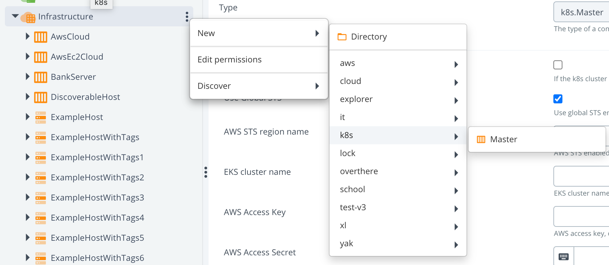
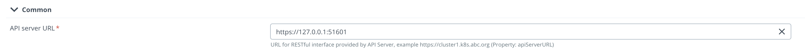
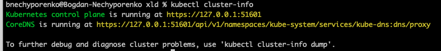
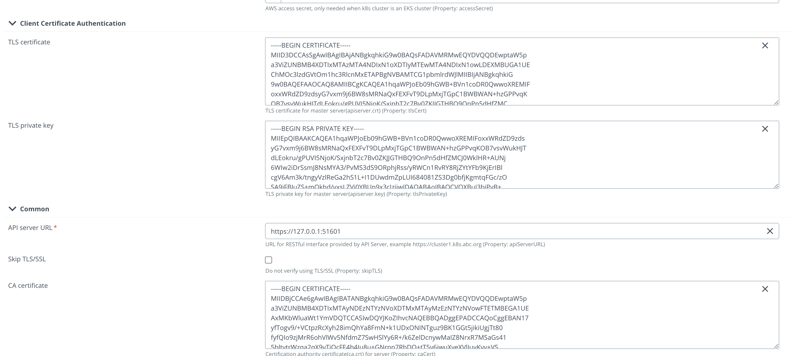
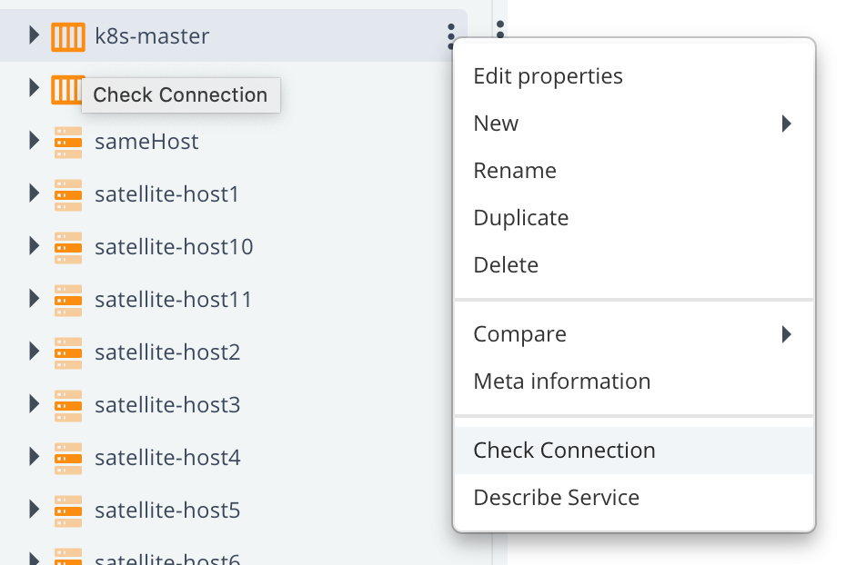
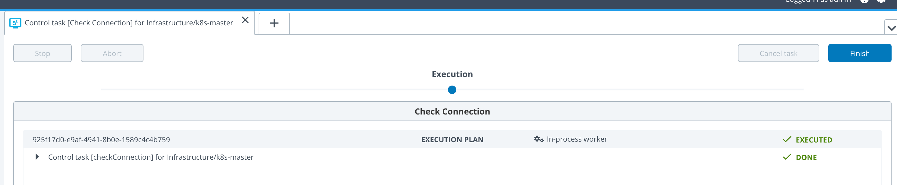
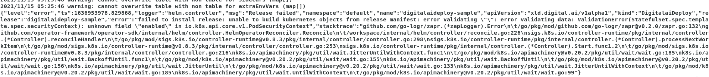
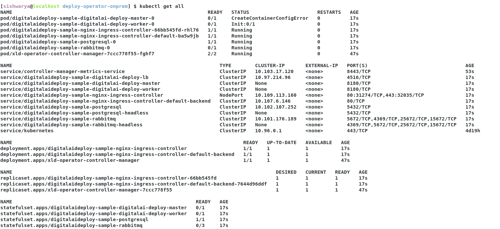
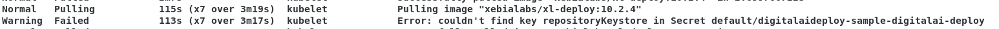
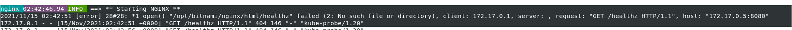

# On Premises

Here you will find a recipe of manual actions how to set up k8s cluster for Deploy locally with help of an operator. 
It will be described how to do it on `minikube`. If you use another tool, you might need to do it a bit differently.

If you already had installed minikube as docker based, first you might have to clean it up with:
```shell script
minikube stop; minikube delete &&
docker stop $(docker ps -aq) &&
rm -rf ~/.kube ~/.minikube &&
sudo rm -rf /usr/local/bin/localkube /usr/local/bin/minikube &&
launchctl stop '*kubelet*.mount' &&
launchctl stop localkube.service &&
launchctl disable localkube.service &&
sudo rm -rf /etc/kubernetes/ &&
docker system prune -af --volumes
```  

First of all you have to run `minikube` as VM. 

Example:
```shell script
minikube start --driver=virtualbox -p k120 --kubernetes-version=v1.20.0
```

We will need Ingress, so we have to install addons to enable it, as it doesn't come with a default setup:

```shell script
minikube addons enable ingress -p k120
minikube addons enable ingress-dns -p k120
```

Next you have to define a resolvable hostname in `/etc/hosts`, for example like:
```text
192.168.59.101 k120
```
where `192.168.59.101` you have to change with the result of `minikube -p k120 ip` 

Then you can use `k120` as a hostname for k8s cluster.

* Go through the process of [scaffolding](../scaffolding.md).
After following these instructions, you'll get on your filesystem the next structure:
```text
bnechyporenko@Bogdan-Nechyporenko xld % ls -al
total 472
drwxr-xr-x  10 bnechyporenko  staff     320 Nov  1 09:40 .
drwxr-xr-x   4 bnechyporenko  staff     128 Nov  3 13:43 ..
-rw-r--r--   1 bnechyporenko  staff     126 Nov  1 09:40 .gitignore
-rw-r--r--   1 bnechyporenko  staff     194 Nov  1 09:40 Dockerfile
-rw-r--r--   1 bnechyporenko  staff    7558 Nov  1 09:40 Makefile
-rw-------   1 bnechyporenko  staff     325 Nov  1 09:41 PROJECT
drwx------  10 bnechyporenko  staff     320 Nov  1 09:41 config
drwxr-xr-x   3 bnechyporenko  staff      96 Nov  1 09:41 helm-charts
-rw-r--r--   1 bnechyporenko  staff     198 Nov  1 09:41 watches.yaml
-rw-r--r--   1 bnechyporenko  staff  214732 Nov  1 09:36 xld.tgz
```
* Create some folder where you can copy and configure the setup. For example `xld-operator-setup`. 
* Copy `config` folder to `xld-operator-setup`. You need only the next 11 files, the rest you can remove:

|Name|Path|
| :---: | :---: |
|cluster-role-digital-proxy-role.yaml|config/rbac/auth_proxy_role.yaml|
|cluster-role-manager-role.yaml|config/rbac/role.yaml|
|cluster-role-metrics-reader.yaml|config/rbac/auth_proxy_client_clusterrole.yaml|
|controller-manager-metrics-service.yaml|config/rbac/auth_proxy_service.yaml|
|custom-resource-definition.yaml|config/crd/bases/xld.my.domain_xldeployhelmcharts.yaml|
|deployment.yaml|config/default/manager_auth_proxy_patch.yaml|
|leader-election-role.yaml|config/rbac/leader_election_role.yaml|
|leader-election-rolebinding.yaml|config/rbac/leader_election_role_binding.yaml|
|manager-rolebinding.yaml|config/rbac/role_binding.yaml|
|proxy-rolebinding.yaml|config/rbac/auth_proxy_role_binding.yaml|
|daideploy_cr.yaml|config/samples/xld_v1alpha1_digitalaideploy.yaml|

That mapping has to be applied in `applications.yaml` file. There you can find 10 references to a file, which initially points to a template (paths needs to be relative). Example:

`file: !file "kubernetes/template/manager-rolebinding.yaml"`

- Next step is to configure locally Deploy. Make sure, that you have installed Kubernetes plugin. 
- First we will manually create infrastructure CI in Deploy to make sure, that provided values are working against a local
 cluster. I will describe how to do it for a `minikube`, so if you are using something else, some technical details can 
 be a bit different, but the idea is the same. 
  - Start creating CI with type k8s.Master 
  - Fill in `API server URL` field:

The command to get your server API:

  - Next 3 fields are regarding the certifications. Therefore we have first to find the place where they are located. As 
it depends on which profile is activated. Check it with a command `minikube profile`. For example for me, the active profile
is `minikube`, and my certificates are located at:

```text
bnechyporenko@Bogdan-Nechyporenko minikube % ls -al ~/.minikube/profiles/minikube
total 88
drwxr-xr-x  12 bnechyporenko  staff   384 Nov  3 13:57 .
drwxr-xr-x   5 bnechyporenko  staff   160 Nov  1 09:41 ..
-rw-r--r--   1 bnechyporenko  staff  1399 Nov  1 09:42 apiserver.crt
-rw-r--r--   1 bnechyporenko  staff  1399 Nov  1 09:42 apiserver.crt.c7fa3a9e
-rw-------   1 bnechyporenko  staff  1679 Nov  1 09:42 apiserver.key
...
```

and one more in a home directory of `minikube`

```text
bnechyporenko@Bogdan-Nechyporenko minikube % ls -al ~/.minikube
total 56
drwxr-xr-x  19 bnechyporenko  staff   608 Nov  3 13:57 .
drwxr-xr-x+ 85 bnechyporenko  staff  2720 Nov  4 10:19 ..
drwxr-xr-x   2 bnechyporenko  staff    64 Oct 25 15:54 addons
drwxr-xr-x   3 bnechyporenko  staff    96 Oct 27 10:12 bin
-rw-r--r--   1 bnechyporenko  staff  1111 Oct 25 15:56 ca.crt
-rw-------   1 bnechyporenko  staff  1679 Oct 25 15:56 ca.key
-rwxr-xr-x   1 bnechyporenko  staff  1099 Nov  3 13:57 ca.pem
...
```

Knowing all this information, we can fill in next fields:

|Field name|Path to the cert|
| :---: | :---: |
|caCert|~/.minikube/ca.crt|
|tlsCert|~/.minikube/profiles/minikube/apiserver.crt|
|tlsPrivateKey|~/.minikube/profiles/minikube/apiserver.key|

:::tip

You have to provide in the field not a path, but a content.  
Example: 

:::

After that we have to verify if the provided configuration is correct, and we can connect to the cluster. For that 
we will use a control task "Check Connection".


If everything configured correctly, you should see something like this: 


- After this success we are ready to fill in the next Yaml file `infrastructure.yaml`
Fill in here these 4 fields: `apiServerURL`, `caCert`, `tlsCert` and `tlsPrivateKey`. 

- Next step is to verify that no mistakes happened during copy-pasting to `infrastructure.yaml`. For that we need to use
[As Code](https://docs.xebialabs.com/v.10.2/deploy/concept/get-started-with-devops-as-code/) feature
 of Deploy to create CIs with help of [XL CLI](https://docs.xebialabs.com/v.10.2/deploy/how-to/install-the-xl-cli/). 
 Please check [XL CLI](https://docs.xebialabs.com/v.10.2/deploy/how-to/install-the-xl-cli/) how to install it.
 Run `xl apply -f infrastructure.yaml` by being in the same directory, or specify the full path to the file. In case you 
 have non-default URL, you have to add this parameter: `--xl-deploy-url YOUR_XL_DEPLOY_URL`
 
- Next thing to tailor few parameters in `xld_v1alpha1_digitalaideploy.yaml`. Copy it from scaffolding folder (you can find it in `config/samples` folder) to a root of `xld-operator-setup` folder.
  - Define or comment  `KeystorePassphrase` and `RepositoryKeystore`
  - Change StorageClass to what you have. For example, you can use 'standard', in case of using local file system. 
It depends [how you configured it](https://xebialabs.github.io/xl-deploy-kubernetes-helm-chart/docs/installing-storage-class). 
  - Define your license in `xldLicense` field, by converting `deployit-license.lic` file's content to base64.
  - Define `RepositoryKeystore` as `zs7OzgAAAAIAAAABAAAAAwAWZGVwbG95aXQtcGFzc3N3b3JkLWtleQAAAX0FGMZRrO0ABXNyADNjb20uc3VuLmNyeXB0by5wcm92aWRlci5TZWFsZWRPYmplY3RGb3JLZXlQcm90ZWN0b3LNV8pZ5zC7UwIAAHhyABlqYXZheC5jcnlwdG8uU2VhbGVkT2JqZWN0PjY9psO3VHACAARbAA1lbmNvZGVkUGFyYW1zdAACW0JbABBlbmNyeXB0ZWRDb250ZW50cQB+AAJMAAlwYXJhbXNBbGd0ABJMamF2YS9sYW5nL1N0cmluZztMAAdzZWFsQWxncQB+AAN4cHVyAAJbQqzzF/gGCFTgAgAAeHAAAAARMA8ECHAyz3pefALRAgMDDUB1cQB+AAUAAACQb6Y2JUQqkd5PtdwIAKEWNiVMcTnIS85U7FsvOb+b+xfOCV8+disezZCQ2f4F6YVGRO++u+NXd0YNDn/eXwge4w7i4ewNBydpMSTpVJieJA3nhh7mvUktatsAV+H7EcGYeMPx/cAlkqyFUHuiGz9p1ft3pxmxey2Uyt/FiBgAiV2hZAj14vGdSoRsMH8qN5ECdAAWUEJFV2l0aE1ENUFuZFRyaXBsZURFU3QAFlBCRVdpdGhNRDVBbmRUcmlwbGVERVO9rqwVmysM6czWLFdUj1+Xh1hxHQ==`. (It's a working dummy example, you are free to use what you wish)
  - Define `KeystorePassphrase` as `deployit`. (It's a working dummy example, you are free to use what you wish)
  - Change namespaces in all yaml files to "default", instead of "system"
  - Change for all `kind: ServiceAccount` the name to `default`.
  - Replace the content of `manager_auth_proxy_patch.yaml` to:
```yaml
apiVersion: apps/v1
kind: Deployment
metadata:
  labels:
    control-plane: controller-manager
  name: xld-operator-controller-manager
spec:
  replicas: 1
  selector:
    matchLabels:
      control-plane: controller-manager
  template:
    metadata:
      labels:
        control-plane: controller-manager
    spec:
      containers:
        - name: kube-rbac-proxy
          image: gcr.io/kubebuilder/kube-rbac-proxy:v0.8.0
          args:
            - "--secure-listen-address=0.0.0.0:8443"
            - "--upstream=http://127.0.0.1:8080/"
            - "--logtostderr=true"
            - "--v=10"
          ports:
            - containerPort: 8443
              name: https
        - name: manager
          args:
            - "--health-probe-bind-address=:8081"
            - "--metrics-bind-address=127.0.0.1:8080"
            - "--leader-elect"
            - "--leader-election-id=xld-operator-controller-manager"
          image: xebialabs/deploy-operator:1.2.0
          livenessProbe:
            httpGet:
              path: /readyz
              port: 8081
            initialDelaySeconds: 15
            periodSeconds: 20
          readinessProbe:
            httpGet:
              path: /healthz
              port: 8081
            initialDelaySeconds: 5
            periodSeconds: 10
          resources:
            limits:
              cpu: 100m
              memory: 90Mi
            requests:
              cpu: 100m
              memory: 60Mi
      terminationGracePeriodSeconds: 10
``` 

- Now you are ready to run the complete configuration with:
`xl apply -v -f digital-ai.yaml`

## Troubleshooting

### Scenario 1

Run **`kubectl get all`** returns only the Operator control manager pods which are deployed on the Kubernetes cluster. No other pods are deployed.
Then verify the operator control pod logs **`kubectl logs --follow pod/xld-operator-controller-manager-7ccc778f55-nfhl5 -c manger`** to identify the error in the cr file.
 If the below error is observed, then remove enabled: true from podSecurityContext tag in `xld_v1alpha1_digitalaideploy.yaml`.
 


###  Scenario 2

- **Step 1** Run **`kubectl get all`** returns the pods, when the below error is observed in master pod, execute step 2 below.



- **Step 2** Run **`kubectl describe pod/digitalaideploy-sample-digitalai-deploy-master-0`** command to identify the issue in container creation. 
When the below error is observed, then define `RepositoryKeystore` and `KeystorePassphrase` `xld_v1alpha1_digitalaideploy.yaml`.



###  Scenario 3

Run **`kubectl get all`** and if you see `pod/digitalaideploy-sample-nginx-ingress-controller-default-bav88kd` pod is failing again and again,
check the pod logs **`kubectl logs --follow pod/digitalaideploy-sample-nginx-ingress-controller-default-bav88kd`** for error, 
and when the below error is observed, update the path to `/` for livenessProbe and readinessProbe of `nginx-ingress-controller` in `xld_v1alpha1_digitalaideploy.yaml`.
 


###  Scenario 4
   
- Run **`kubectl get all`** and if your master and worker instance is not starting.
- Change the `XldMasterPvcSize: 2Gi` and `XldWorkerPvcSize: 2Gi` in xld_v1alpha1_digitalaideploy.yaml.
- Verify number of cpus and memory allocated for kubernetes using below command, and if necessary increase the memory and cpus as part of minikube startup `minikube start --driver=docker --kubernetes-version=v1.20.0 -p k120 --cpus=4 --memory=15600MB`

```shell script
  [sishwarya@localhost deploy-operator-onprem] $ kubectl get node k120 -o jsonpath='{.status.capacity}'
        {"cpu":"8","ephemeral-storage":"51175Mi","hugepages-1Gi":"0","hugepages-2Mi":"0","memory":"32301572Ki","pods":"110"}
```

## Uninstall

* Perform undeploy of operator in Deploy
* Remove manually all other CIs left in Deploy
* Clean PVCs manually

First you have to check what PVC were created
```shell script
bnechyporenko@Bogdan-Nechyporenko k120 % kubectl get pvc
NAME                                         STATUS   VOLUME                                     CAPACITY   ACCESS MODES   STORAGECLASS   AGE
data-dai-xld-postgresql-0                    Bound    pvc-225272f8-f690-40fd-be5f-98d28c874e17   50Gi       RWO            standard       23m
data-dai-xld-rabbitmq-0                      Bound    pvc-b0580680-e119-41f9-961b-ab344170a654   8Gi        RWO            standard       23m
data-dir-dai-xld-digitalai-deploy-master-0   Bound    pvc-1bfb745b-b451-4103-881c-3e9995033203   10Gi       RWO            standard       23m
data-dir-dai-xld-digitalai-deploy-worker-0   Bound    pvc-a1ee162a-da5f-4eb9-8346-5ef3e006861f   10Gi       RWO            standard       23m
```

Afterwards, remove it like that:
```shell script
bnechyporenko@Bogdan-Nechyporenko k120 % kubectl delete pvc data-dai-xld-postgresql-0 data-dai-xld-rabbitmq-0 data-dir-dai-xld-digitalai-deploy-master-0 data-dir-dai-xld-digitalai-deploy-worker-0
```
