# AWS OpenShift

:::caution
This is internal documentation. This document can be used only if it was recommended by the Support Team.
:::


Here it will described how to install manually Deploy k8s cluster with help of operator to Open Shift. 
As a tool to work with is taken AWS OpenShift.

* First check the doc how to work with an [Operator on Premises](https://xebialabs.github.io/xl-deploy-kubernetes-operator/docs/manual/onprem),
 as those details are not covered here.
* You should configure your [AWS CLI locally](https://docs.aws.amazon.com/cli/latest/userguide/cli-configure-quickstart.html)
* Create an account in RedHat and follow the procedure of installing ROSA https://docs.openshift.com/rosa/rosa_getting_started/rosa-installing-rosa.html
* Once it is done, it's very important to [configure IdP (identity provider)](https://docs.openshift.com/rosa/rosa_getting_started/rosa-config-identity-providers.html) in order to be able to access the cluster via `serverURL` and `token`.
These 2 parameters are used in Deploy to have a communication with OpenShift cluster.   
If it was configured correctly this command will succeed:
```shell script
oc login --token=TOKEN --server=SERVER_URL
```

`SERVER_URL` you can find the next way.
 
First find the cluster's console URL in the output of command:

```shell script
rosa describe cluster --cluster=CLUSTER_NAME
```

When you open it, you will see on `Cluster` tab your new created cluster
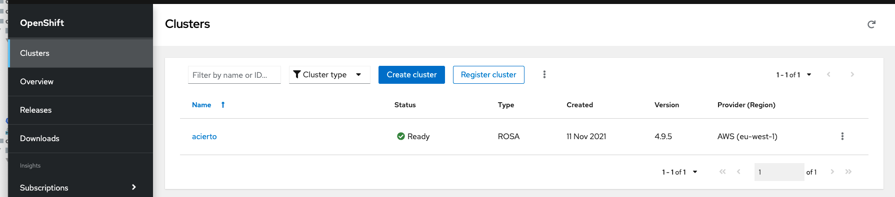

Click on it, and open `Networking` tab
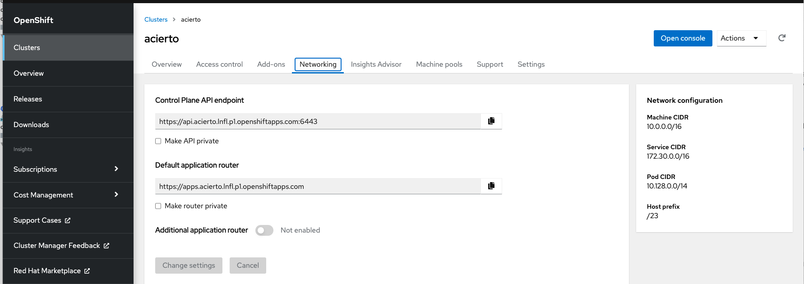.

"Control Plane API endpoint" is your SERVER_URL.
"Default application router" you have to use in `DigitalaiDeployOcp` to specify the `hosts` field. 
Only be aware that it should have only hostname, no protocol or port defined. So for this example it will be
```yaml
hosts:
    - router-default.apps.acierto.lnfl.p1.openshiftapps.com
```

**router-default** is a name of a default router configured by OpenShift.
You can also find it in OpenShift Console UI:

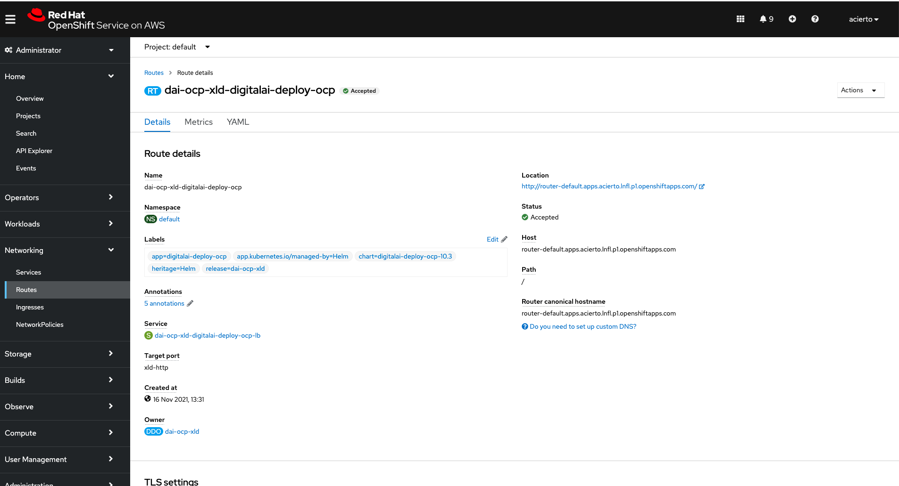 

Also very important thing, when IdP is created, you have to create a user with the same name. You can find it here:
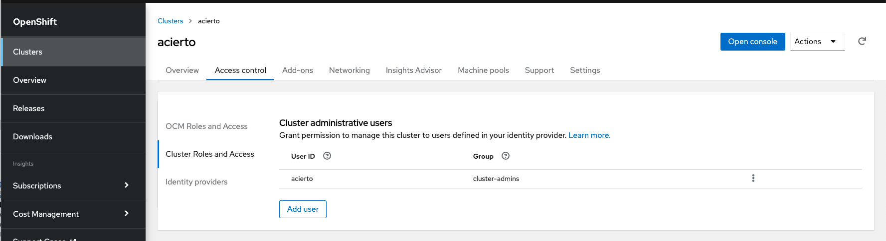

When all configuration is done, and you deployed the Operator, you can interact with the cluster with help of `oc`.
Just instead of `kubectl` will be `oc`.

## How to configure AWS EFS

This is [the article](https://docs.openshift.com/container-platform/4.2/storage/persistent_storage/persistent-storage-efs.html) to start the configuration from.
The most important points which are missing there:

* Network should attach a mounted target with VPC and Subnet Group which is the same as where cluster is created.

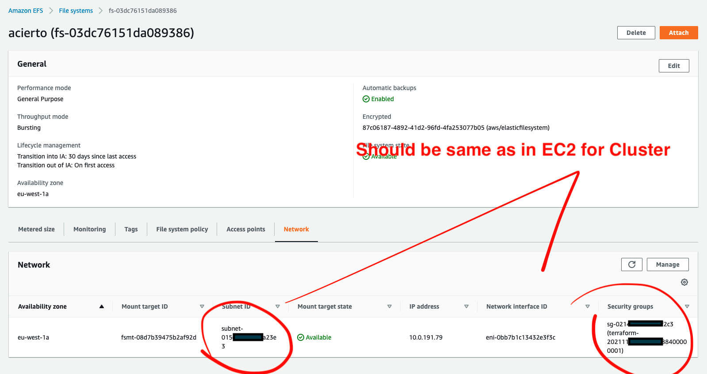 

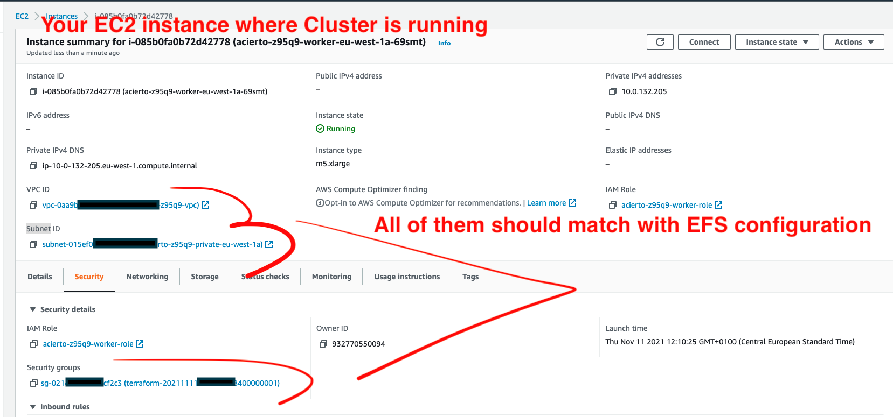

* Make sure that your SubGroup has a configuration for NFS.

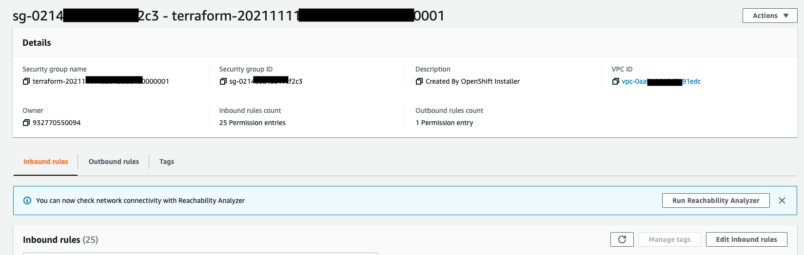
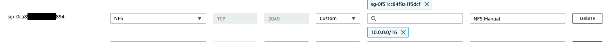

* Access point should be created to a root folder "/" with 777 permissions to any random ID user.

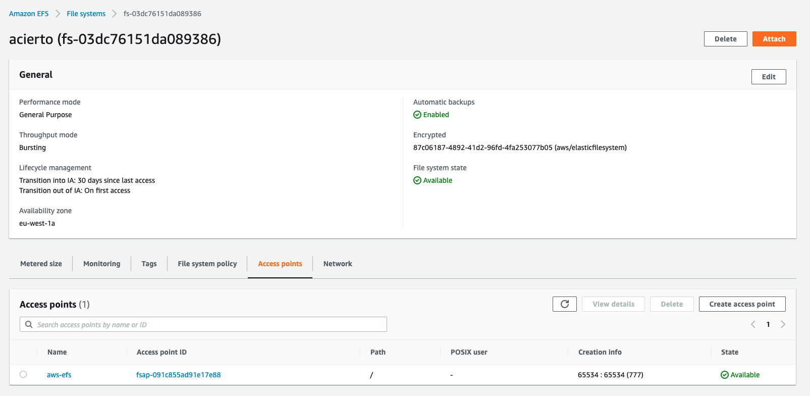

After you make `efs-provisioner` up and running you have to switch your storageclass to aws-efs as default, it will look like

```yaml
bnechyporenko@Bogdan-Nechyporenko ~ % oc get sc
NAME                PROVISIONER             RECLAIMPOLICY   VOLUMEBINDINGMODE      ALLOWVOLUMEEXPANSION   AGE
aws-efs (default)   openshift.org/aws-efs   Delete          Immediate              false                  30h
efs-sc              efs.csi.aws.com         Delete          Immediate              false                  24h
gp2                 kubernetes.io/aws-ebs   Delete          WaitForFirstConsumer   true                   5d3h
gp2-csi             ebs.csi.aws.com         Delete          WaitForFirstConsumer   true                   5d3h
```

Commands to do it:

```shell script
oc patch storageclass aws-efs -p '{"metadata": {"annotations":{"storageclass.kubernetes.io/is-default-class":"true"}}}'
```

```shell script
oc patch storageclass gp2 -p '{"metadata": {"annotations":{"storageclass.kubernetes.io/is-default-class":"false"}}}'
```

When configured all properly, all pods have to be up and running

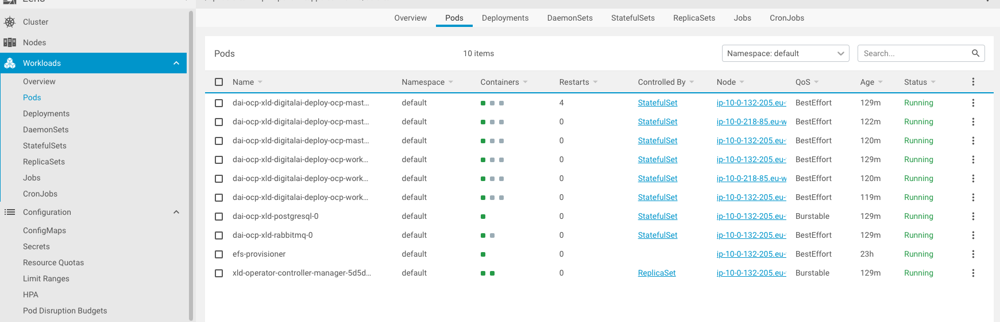

and server accessed by the provided host in the configuration

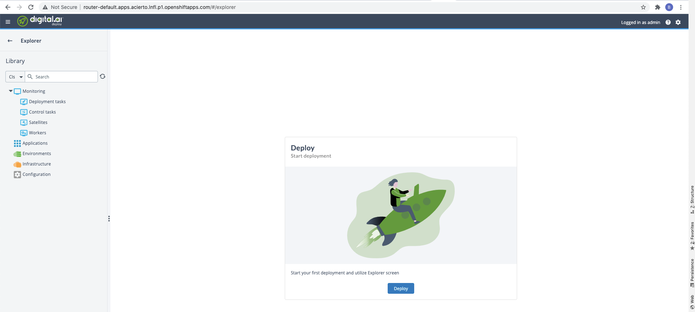

## Troubleshooting

In some cases you can face with issues in PostreSQL and have no actual error logs. 
To overcome it, you have to enable debug mode for it. You can do it by enabling debug to `true` in values:

```yaml
image:
  debug: true
  pullPolicy: IfNotPresent
  registry: docker.io
  repository: bitnami/postgresql
  tag: 11.9.0-debian-10-r48
```
 
