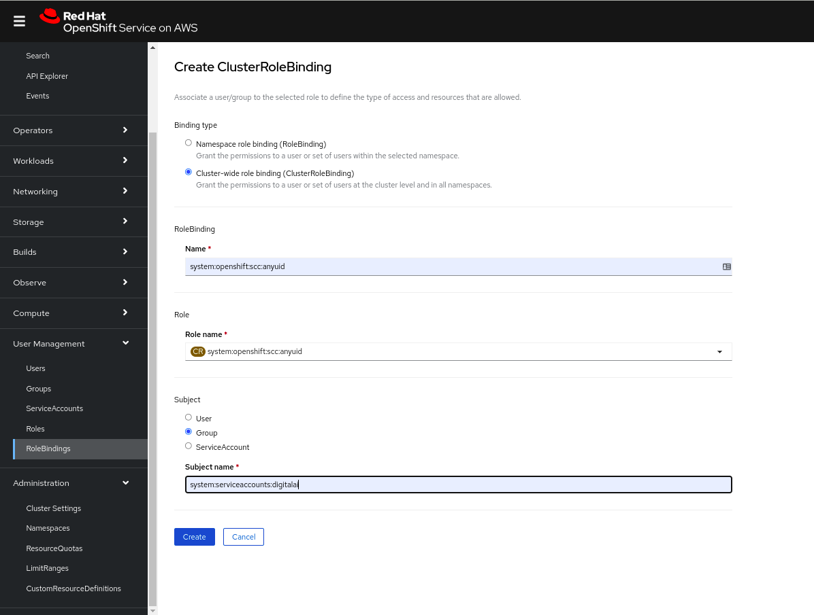

# Setting up custom namespace

## Manual setup

### Prerequisites

- Linux environment
- The kubectl command-line tool
- Access to a Kubernetes cluster to install Deploy

### Create custom namespace

Setup custom namespace on Kubernetes cluster, `custom-namespace-1` for example:
```shell
❯ kubectl create namespace custom-namespace-1
```

### Update the deploy operator package to support custom namespace

Update following files (relative to the provider's directory) with custom namespace name:

| File name                                                                 | Yaml path                                     | Value to set                                        |
|:--------------------------------------------------------------------------|:----------------------------------------------|:----------------------------------------------------|
| digitalai-deploy/infrastructure.yaml                                      | spec[0].children[0].children[0].name          | custom-namespace-1                                  |
| digitalai-deploy/infrastructure.yaml (not on OpenShift)                   | spec[0].children[0].children[0].namespaceName | custom-namespace-1                                  |
| digitalai-deploy/infrastructure.yaml (only on OpenShift)                  | spec[0].children[0].children[0].projectName   | custom-namespace-1                                  |
| digitalai-deploy/environment.yaml                                         | spec[0].children[0].members[0]                | ~Infrastructure/k8s-infra/xld/custom-namespace-1    |
| digitalai-deploy/kubernetes/template/cluster-role-digital-proxy-role.yaml | metadata.name                                 | custom-namespace-1-xld-operator-proxy-role          |
| digitalai-deploy/kubernetes/template/cluster-role-manager-role.yaml       | metadata.name                                 | custom-namespace-1-xld-operator-manager-role        |
| digitalai-deploy/kubernetes/template/cluster-role-metrics-reader.yaml     | metadata.name                                 | custom-namespace-1-xld-operator-metrics-reader      |
| digitalai-deploy/kubernetes/template/leader-election-rolebinding.yaml     | subjects[0].namespace                         | custom-namespace-1                                  |
| digitalai-deploy/kubernetes/template/manager-rolebinding.yaml             | metadata.name                                 | custom-namespace-1-xld-operator-manager-rolebinding |
| digitalai-deploy/kubernetes/template/manager-rolebinding.yaml             | roleRef.name                                  | custom-namespace-1-xld-operator-manager-role        |
| digitalai-deploy/kubernetes/template/manager-rolebinding.yaml             | subjects[0].namespace                         | custom-namespace-1                                  |
| digitalai-deploy/kubernetes/template/proxy-rolebinding.yaml               | metadata.name                                 | custom-namespace-1-xld-operator-proxy-rolebinding   |
| digitalai-deploy/kubernetes/template/proxy-rolebinding.yaml               | roleRef.name                                  | custom-namespace-1-xld-operator-proxy-role          |
| digitalai-deploy/kubernetes/template/proxy-rolebinding.yaml               | subjects[0].namespace                         | custom-namespace-1                                  |
| digitalai-release/kubernetes/dairelease_cr.yaml                           | metadata.name                                 | dai-xld-custom-namespace-1                          |

:::note
Note:
Following ingress changes on ingress are not needed for OpenShift and On Premise setups. 
On this two providers there is already provider's ingress setup. 
:::

Following changes are in case of usage nginx ingress (default behaviour):

| File name                                     | Yaml path                                                          | Value to set                                    |
|:----------------------------------------------|:-------------------------------------------------------------------|:------------------------------------------------|
| digitalai-deploy/kubernetes/daideploy_cr.yaml | spec.ingress.annotations.kubernetes.io/ingress.class               | nginx-dai-xld-custom-namespace-1                |
| digitalai-deploy/kubernetes/daideploy_cr.yaml | spec.nginx-ingress-controller.extraArgs.ingress-class              | nginx-dai-xld-custom-namespace-1                |
| digitalai-deploy/kubernetes/daideploy_cr.yaml | spec.nginx-ingress-controller.ingressClassResource.controllerClass | k8s.io/ingress-nginx-dai-xld-custom-namespace-1 |
| digitalai-deploy/kubernetes/daideploy_cr.yaml | spec.nginx-ingress-controller.ingressClassResource.name            | nginx-dai-xld-custom-namespace-1                |


Following changes are in case of usage haproxy ingress:
- `spec.haproxy-ingress.install = true`
- `spec.nginx-ingress-controller.install = false`

| File name                                     | Yaml path                                            | Value to set                       |
|:----------------------------------------------|:-----------------------------------------------------|:-----------------------------------|
| digitalai-deploy/kubernetes/daideploy_cr.yaml | spec.ingress.annotations.kubernetes.io/ingress.class | haproxy-dai-xld-custom-namespace-1 |
| digitalai-deploy/kubernetes/daideploy_cr.yaml | spec.haproxy-ingress.controller.ingressClass         | haproxy-dai-xld-custom-namespace-1 |


:::note
Note:
- Disable keycloak for now, setup was yet tested with keycloak enabled.
- If you are just setting up one Deploy on the cluster: you could omit changes related to the renaming cluster roles, but that is not recommended because 
of consistency and if you in future will require starting additional Deploy on the same cluster (in other namespace) you will have problems with cluster naming collisions
:::

:::note
If you already have on the cluster CRD `digitalaideploys.xld.digital.ai`, in that case you need to skip installation of the CRD again on the cluster.
That CRD already exists on the cluster if you have on the same cluster installation of the Deploy in some other namespace.
To check existence of the CRD run:
```shell
❯ kubectl get crd
NAME                                             CREATED AT
digitalaideploys.xld.digital.ai                  2022-03-31T19:03:30Z
```
To do that remove from the file `digitalai-deploy/applications.yaml` section that is under path `spec[0].children[0].deployables[7]` 
(it is section with `name: custom-resource-definition`).
:::

After setup, you can continue with standard deployment of the Deploy to the Kubernetes cluster.


## Semi-automatic setup with xl-cli

### Prerequisites

- Linux environment
- The kubectl command-line tool
- The yq command-line tool ([Use the latest binary](https://github.com/mikefarah/yq/releases))
- The xl-cli (currently only nightly release has supported feature)
- Access to a Kubernetes cluster to install Deploy

### Create custom namespace

Setup custom namespace on Kubernetes cluster, `custom-namespace-2` for example:
```shell
❯ kubectl create namespace custom-namespace-2
```

### Update the deploy operator package to support custom namespace

:::note
In case of haproxy ingress setup, you need first to setup everything what is needed for haproxy ingress:
- `spec.haproxy-ingress.install = true`
- `spec.nginx-ingress-controller.install = false`
- `spec.ingress.annotations.kubernetes.io/ingress.class = haproxy`
- `spec.keycloak.ingress.annotations.kubernetes.io/ingress.class = haproxy`
:::

Instead of updating manually YAML files in the operator package, you can update them by running xl-cli: 
```shell
xl op --change-namespace
? Select the Kubernetes setup where the digitalai Devops Platform will be installed or uninstalled: AzureAKS [Azure AKS]
? Do you want to use Kubernetes' current-context from ~/.kube/config? Yes
? Do you want to use an custom Kubernetes namespace? Do you want to use an custom Kubernetes namespace? Yes
? Enter the name of the existing Kubernetes namespace where the XebiaLabs DevOps Platform will be installed, updated or undeployed: custom-namespace-2
? Product server you want to deploy? daiDeploy
? Does product custom resource definition already exists on the cluster? No
? Enter path to the operator package: /xl/master/xl-deploy-kubernetes-operator
Everything has been updated!
```

From the questions, last 2 could be interesting:

- `? Does product custom resource definition already exists on the cluster. (y/N)`
This is question about should product installation create CRD `digitalaideploys.xld.digital.ai`. 
Check if on the cluster there is already specified CRD. If there is the CRD in that case answer with `y` to skip CRD installation. For example:
```shell
❯ kubectl get crd
NAME                                             CREATED AT
digitalaideploys.xld.digital.ai                  2022-03-31T19:03:30Z
```

- `? Enter path to the operator package.`
For this answer you need specify path to the unzipped operator package

## Troubleshooting

If keycloak pod is not starting on OpenShift cluster, and you can see this error for keycloak StatefulSet:

`Warning FailedCreate 2m11s (x3 over 2m11s) statefulset-controller create Pod dai-ocp-xld-cn1502-k-0 in StatefulSet dai-ocp-xld-cn1502-k failed error: pods "dai-ocp-xld-cn1502-k-0" is forbidden: unable to validate against any security context constraint: [provider "anyuid": Forbidden: not usable by user or serviceaccount`

then you have to add security constraint context for your custom namespace using any of these 3 options:
1. Using oc command.
    * oc version above , Client Version: 4.7.5, Server Version: 4.9.21.
```shell
[sishwarya@localhost bin] $ oc version
Client Version: 4.7.5
Server Version: 4.9.21
Kubernetes Version: v1.22.3+fdba464
```
```shell
oc adm policy add-scc-to-group anyuid system:serviceaccounts:<custom-namespace>
```
2. Using the kubectl-create, create the clusterRole_anyuid.yaml file with below content.
```yaml
kind: ClusterRoleBinding
apiVersion: rbac.authorization.k8s.io/v1
metadata:
  name: 'system:openshift:scc:anyuid'
subjects:
  - kind: Group
    apiGroup: rbac.authorization.k8s.io
    name: 'system:serviceaccounts:<custom-namespace>'
roleRef:
  apiGroup: rbac.authorization.k8s.io
  kind: ClusterRole
  name: 'system:openshift:scc:anyuid'
```
```shell
[sishwarya@localhost openshift] $ kubectl create -f clusterRole_anyuid.yaml 
clusterrolebinding.rbac.authorization.k8s.io/system:openshift:scc:anyuid created
[sishwarya@localhost openshift] $ kubectl get ClusterRoleBinding system:openshift:scc:anyuid
NAME                          ROLE                                      AGE
system:openshift:scc:anyuid   ClusterRole/system:openshift:scc:anyuid   87s
```
3. Using the openshift Dashboard.
* Create the ClusterRoleBinding via Dashboard.
  
