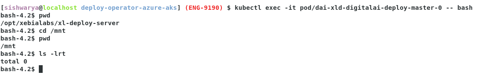
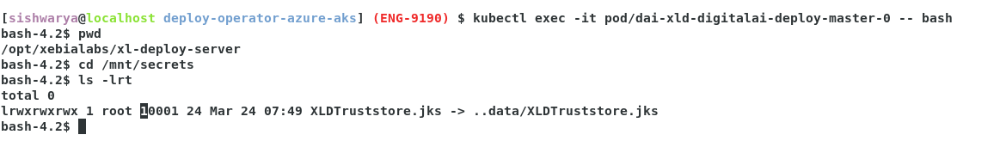
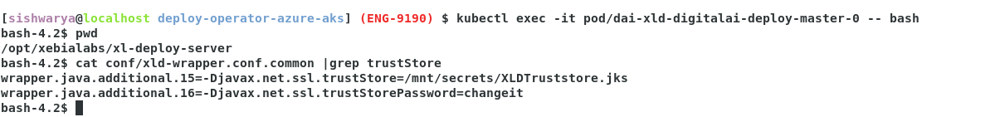

# Adding truststore files

## Prerequisites

- Linux environment
- The kubectl command-line tool
- The yq command-line tool ([Use the latest binary](https://github.com/mikefarah/yq/releases))
- Access to a Kubernetes cluster with installed Release

## Adding truststore file generic example for Deploy.
* Add certificate to truststore (XLDTruststore.jks)
  * ```shell
     keytool -import -alias exampleCert -file exampleCert.cer -keystore XLDTruststore.jks
     ```
* Create secret yaml "xld-trust-store_secret.yaml"
  * ```yaml
     apiVersion: v1
     kind: Secret
     metadata:
     name: xld-secret-store
     namespace: default
     data:
       XLDTruststore.jks: "<base 64 from previous command here 'cat XLDTruststore.jks | base64'>"       
    ```
  * ```shell
     kubectl apply -f xld-trust-store_secret.yaml
     ```
  * ```shell
     kubectl get secret xld-secret-store
     [sishwarya@localhost deploy] (ENG-9190) $ kubectl get secret xld-secret-store
      NAME               TYPE     DATA   AGE
      xld-secret-store   Opaque   1      5m2s
     ```  
* By editing STS, create volumemount and volumes for the created secret in above step.
  
  *
  

  * Create volumemount and volumes for the created secret.
    ```shell
       kubectl get statefulset.apps/dai-xld-digitalai-deploy-master -o yaml > deploy_sts.yaml
       ```
    * update the volume mount and volume for secret.
      * volume mount
        ```yaml
            volumeMounts:
            - mountPath: /mnt/secrets
               name: xld-secret-store-volume
               readOnly: true
        ```
      * volume
        ```yaml
             volumes:
             - name: xld-secret-store-volume
               secret:
                  secretName: xld-secret-store
                  items:
                  - key: XLDTruststore.jks
                    path: XLDTruststore.jks
        ```
      * ```shell
        kubectl apply -f deploy_sts.yaml
        ```
      * 
  
 * Restart Deploy masters:
    ```shell
    ❯ kubectl delete pod dai-xld-digitalai-deploy-master-0
    ```


## Update xld-wrapper.conf.common. 

*  Configure Deploy to use the truststore.

* Get current xld-wrapper.conf.common file from the deploy server node:
    ```shell
    ❯ kubectl cp dai-xld-digitalai-deploy-master-0:/opt/xebialabs/xl-deploy-server/conf/xld-wrapper.conf.common ./xld-wrapper.conf.common
    ```

* Create following template file to append to it the retrieved `./xld-wrapper.conf.common`:
    ```shell
    ❯ echo 'apiVersion: v1
    kind: ConfigMap
    metadata:
      name: xld-wrapper-conf-common-config-map
      labels:
        app: digitalai-deploy
    data:
      xld-wrapper.conf.common: |' > config-patch-xld-wrapper-conf-common.yaml.template
    ```

* Merge the files:
    ```shell
    ❯ cat config-patch-xld-wrapper-conf-common.yaml.template > config-patch-xld-wrapper-conf-common.yaml
    ❯ sed -e 's/^/     /' xld-wrapper.conf.common >> config-patch-xld-wrapper-conf-common.yaml
    ```

* Change the config in the `config-patch-xld-wrapper-conf-common.yaml`.
    ```text
    Add the following line, where ‘X’ is the next number in the wrapper.java.additional list:
    wrapper.java.additional.X=-Djavax.net.ssl.trustStore=/mnt/secrets/XLDTruststore.jks
    wrapper.java.additional.X+1=-Djavax.net.ssl.trustStorePassword=changeit
    ```

* Create the config map with `config-patch-xld-wrapper-conf-common.yam`:
    ```shell
    ❯ kubectl create -f config-patch-xld-wrapper-conf-common.yaml
    ```

* Get all statefulsets (deploy statefulset will be suffixed with `-deploy-master`):
    ```shell
    ❯ kubectl get sts -o name
    ```

* Change the statefulset for the deploy server by adding volume mounts and volumes:
    ```shell
    ❯ kubectl get statefulset.apps/dai-xld-digitalai-deploy-master -o yaml \
        | yq eval '.spec.template.spec.containers[0].volumeMounts += {
            "mountPath": "/opt/xebialabs/xl-deploy-server/conf/xld-wrapper.conf.common",
            "name": "xld-wrapper-conf-common-volume",
            "subPath": "xld-wrapper.conf.common"
          }' - \
        | yq eval '.spec.template.spec.volumes += [{
            "name": "xld-wrapper-conf-common-volume",
            "configMap": {
              "name": "xld-wrapper-conf-common-config-map"
            }
          }]' - \
        | kubectl replace -f -
    ```
* Restart Deploy masters:
  ```shell
  ❯ kubectl delete pod dai-xld-digitalai-deploy-master-0
  ```

* 
